# Gaze Bounty Coin Contract

This is the Gaze Bounty Coin (GBC) that will eventually be converted into the Gaze Coin at the end of the Gaze Coin crowdsale.

The GBC token contract is deployed to [0x45bE456a56f6D82175Ce7f921954d2451Db73161](https://etherscan.io/token/0x45bE456a56f6D82175Ce7f921954d2451Db73161#balances).

GBC token transfers can be viewed at [https://etherscan.io/token/0x45bE456a56f6D82175Ce7f921954d2451Db73161](https://etherscan.io/token/0x45bE456a56f6D82175Ce7f921954d2451Db73161).

The first ever 888.888888888888888888 GBC minted - [0x3c6e0939](https://etherscan.io/tx/0x3c6e093930429d4360da77cff44f375c102bf1ff9e9240d25e795bb5fbeb7a42):

<kbd>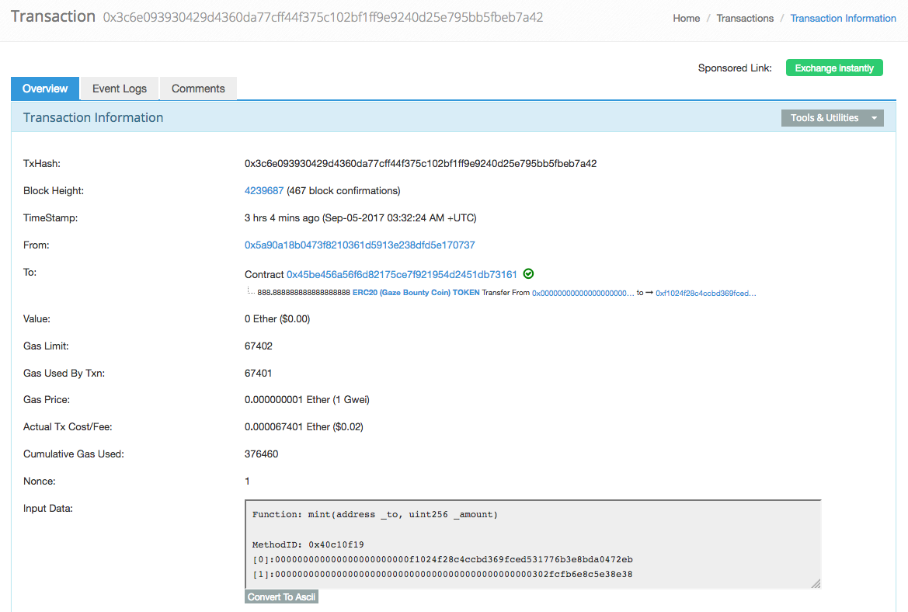</kbd>

Jonny has just executed the first GBC transaction:

<kbd>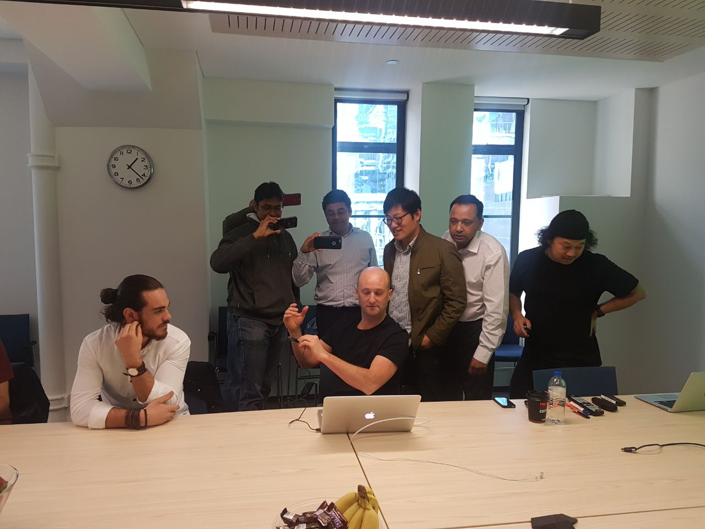</kbd>

<kbd></kbd>

And the transaction on EtherScan:

<kbd>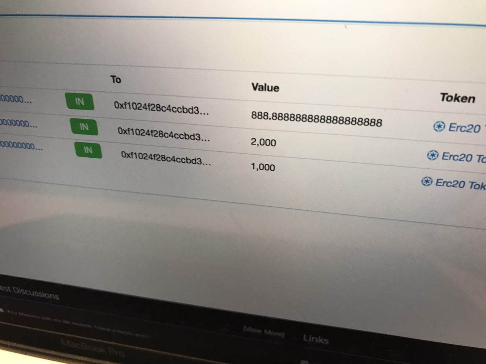</kbd>

And Fei received the first 888.888888888888888888 GBCs:

<kbd></kbd>

The source code for the GBC token contract can be found at [contracts/GazeBountyCoin.sol](contracts/GazeBountyCoin.sol).

 

## Table Of Contents

* [Minting GBCs With MyEtherWallet](#minting-gbcs-with-myetherwallet)
  * [Minting GBCs With MyEtherWallet Using Ledger Nano S](#minting-gbcs-with-myetherwallet-using-ledger-nano-s)
  * [Minting GBCs With MyEtherWallet Using A Keystore File](#minting-gbcs-with-myetherwallet-using-a-keystore-file)
* [Setting Up The GBC Contract In MyEtherWallet](#setting-up-the-gbc-contract-in-myetherwallet)
* [Transaction Cost](#transaction-cost)

 

## Minting GBCs With MyEtherWallet

Your account will need to be set up as an admnistrator account in the GBC token contract.

Navigate to [https://www.myetherwallet.com/](https://www.myetherwallet.com/#contracts) and select the **Contracts** tab.

See [Setting Up The GBC Contract In MyEtherWallet](#setting-up-the-gbc-contract-in-myetherwallet).

Select the `mint` function and:

* Enter the destination address in the *_to** field. This is the 40 character public address for the account receiving the GBC tokens. This address
  will resemble `0xC2D7CF95645D33006175B78989035C7c9061d3F9`

* Enter the amount of GBC tokens in the **_amount** field. Note that this is the "natural number" for the tokens and must include
  the 18 decimal places, so 1.234567890123456789 GBCs is represented as 1234567890123456789 (or 1,234,567,890,123,456,789).

 

### Minting GBCs With MyEtherWallet Using Ledger Nano S

Select the **Ledger Wallet** option, then click **Connect to Ledger Wallet**:

<kbd>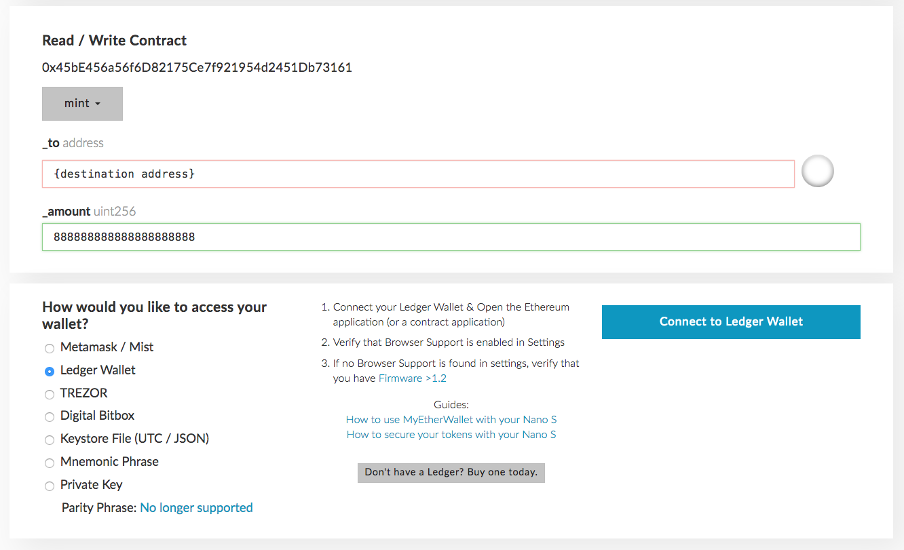</kbd>

Select the account you want to use to execute this transaction, then click **Unlock your Wallet**:

<kbd>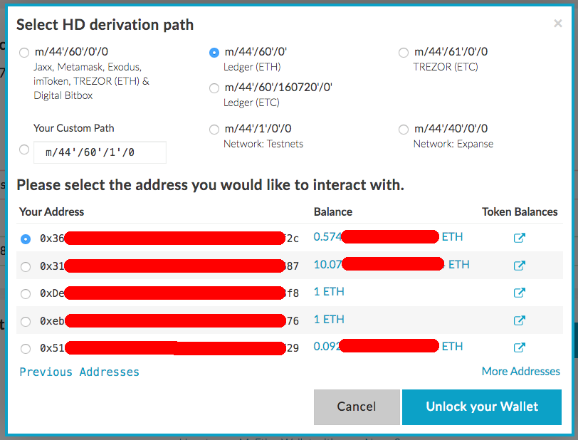</kbd>

Click **WRITE**. Make sure that the **Gas Limit** is at least 80,000 and **Amount to Send** is 0:

<kbd>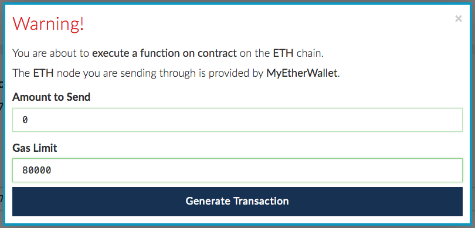</kbd>

Click **Generate Transaction**

Authorise the transaction on your Ledger Nano S device. Check the transaction details, then click on the right button.

<kbd>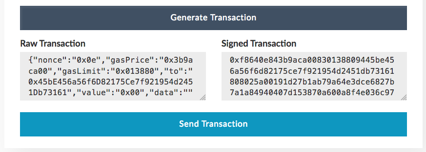</kbd>

Click **Send Transaction**

Your minting transaction should appear in [https://etherscan.io/address/0x45bE456a56f6D82175Ce7f921954d2451Db73161](https://etherscan.io/address/0x45bE456a56f6D82175Ce7f921954d2451Db73161).

When minted, your token transfer should appear in [https://etherscan.io/token/0x45bE456a56f6D82175Ce7f921954d2451Db73161](https://etherscan.io/token/0x45bE456a56f6D82175Ce7f921954d2451Db73161).

 

### Minting GBCs With MyEtherWallet Using A Keystore File

Select the **Keystore File (UTC / JSON)** option, then click **SELECT WALLET FILE...**. Enter your password to unlock your keystore.

Click **WRITE**. Make sure that the **Gas Limit** is at least 80,000 and **Amount to Send** is 0:

<kbd></kbd>

Click **Generate Transaction**

<kbd>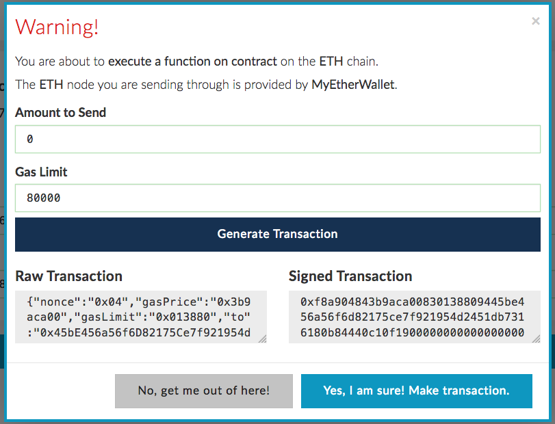</kbd>

Click **Yes, I am sure! Make transaction.**

Your minting transaction should appear in [https://etherscan.io/address/0x45bE456a56f6D82175Ce7f921954d2451Db73161](https://etherscan.io/address/0x45bE456a56f6D82175Ce7f921954d2451Db73161).

When minted, your token transfer should appear in [https://etherscan.io/token/0x45bE456a56f6D82175Ce7f921954d2451Db73161](https://etherscan.io/token/0x45bE456a56f6D82175Ce7f921954d2451Db73161).

 

## Setting Up The GBC Contract In MyEtherWallet

Navigate to [https://www.myetherwallet.com/](https://www.myetherwallet.com/#contracts) and select the **Contracts** tab.

In the **Contract Address** field, enter `0x45bE456a56f6D82175Ce7f921954d2451Db73161`.

In the **ABI / JSON Interface** text box, copy and paste the following text:

> [{"constant":true,"inputs":[],"name":"name","outputs":[{"name":"","type":"string"}],"payable":false,"stateMutability":"view","type":"function"},{"constant":false,"inputs":[{"name":"_spender","type":"address"},{"name":"_amount","type":"uint256"}],"name":"approve","outputs":[{"name":"success","type":"bool"}],"payable":false,"stateMutability":"nonpayable","type":"function"},{"constant":true,"inputs":[],"name":"totalSupply","outputs":[{"name":"","type":"uint256"}],"payable":false,"stateMutability":"view","type":"function"},{"constant":false,"inputs":[{"name":"_from","type":"address"},{"name":"_to","type":"address"},{"name":"_amount","type":"uint256"}],"name":"transferFrom","outputs":[{"name":"success","type":"bool"}],"payable":false,"stateMutability":"nonpayable","type":"function"},{"constant":false,"inputs":[{"name":"_to","type":"address[]"},{"name":"_amount","type":"uint256[]"}],"name":"multiMint","outputs":[],"payable":false,"stateMutability":"nonpayable","type":"function"},{"constant":true,"inputs":[],"name":"decimals","outputs":[{"name":"","type":"uint8"}],"payable":false,"stateMutability":"view","type":"function"},{"constant":false,"inputs":[{"name":"_adminAddress","type":"address"}],"name":"removeAdministrators","outputs":[],"payable":false,"stateMutability":"nonpayable","type":"function"},{"constant":false,"inputs":[],"name":"seal","outputs":[],"payable":false,"stateMutability":"nonpayable","type":"function"},{"constant":false,"inputs":[{"name":"_to","type":"address"},{"name":"_amount","type":"uint256"}],"name":"mint","outputs":[],"payable":false,"stateMutability":"nonpayable","type":"function"},{"constant":true,"inputs":[{"name":"_account","type":"address"}],"name":"balanceOf","outputs":[{"name":"balance","type":"uint256"}],"payable":false,"stateMutability":"view","type":"function"},{"constant":true,"inputs":[{"name":"","type":"address"}],"name":"administrators","outputs":[{"name":"","type":"bool"}],"payable":false,"stateMutability":"view","type":"function"},{"constant":false,"inputs":[],"name":"acceptOwnership","outputs":[],"payable":false,"stateMutability":"nonpayable","type":"function"},{"constant":true,"inputs":[],"name":"owner","outputs":[{"name":"","type":"address"}],"payable":false,"stateMutability":"view","type":"function"},{"constant":false,"inputs":[{"name":"_adminAddress","type":"address"}],"name":"addAdministrators","outputs":[],"payable":false,"stateMutability":"nonpayable","type":"function"},{"constant":true,"inputs":[],"name":"symbol","outputs":[{"name":"","type":"string"}],"payable":false,"stateMutability":"view","type":"function"},{"constant":false,"inputs":[{"name":"_to","type":"address"},{"name":"_amount","type":"uint256"}],"name":"transfer","outputs":[{"name":"success","type":"bool"}],"payable":false,"stateMutability":"nonpayable","type":"function"},{"constant":true,"inputs":[],"name":"newOwner","outputs":[{"name":"","type":"address"}],"payable":false,"stateMutability":"view","type":"function"},{"constant":false,"inputs":[{"name":"tokenAddress","type":"address"},{"name":"amount","type":"uint256"}],"name":"transferAnyERC20Token","outputs":[{"name":"success","type":"bool"}],"payable":false,"stateMutability":"nonpayable","type":"function"},{"constant":true,"inputs":[{"name":"_owner","type":"address"},{"name":"_spender","type":"address"}],"name":"allowance","outputs":[{"name":"remaining","type":"uint256"}],"payable":false,"stateMutability":"view","type":"function"},{"constant":true,"inputs":[],"name":"sealed","outputs":[{"name":"","type":"bool"}],"payable":false,"stateMutability":"view","type":"function"},{"constant":false,"inputs":[{"name":"_newOwner","type":"address"}],"name":"transferOwnership","outputs":[],"payable":false,"stateMutability":"nonpayable","type":"function"},{"inputs":[],"payable":false,"stateMutability":"nonpayable","type":"constructor"},{"payable":false,"stateMutability":"nonpayable","type":"fallback"},{"anonymous":false,"inputs":[{"indexed":false,"name":"adminAddress","type":"address"}],"name":"AdminstratorAdded","type":"event"},{"anonymous":false,"inputs":[{"indexed":false,"name":"adminAddress","type":"address"}],"name":"AdminstratorRemoved","type":"event"},{"anonymous":false,"inputs":[{"indexed":true,"name":"_from","type":"address"},{"indexed":true,"name":"_to","type":"address"}],"name":"OwnershipTransferred","type":"event"},{"anonymous":false,"inputs":[{"indexed":true,"name":"_from","type":"address"},{"indexed":true,"name":"_to","type":"address"},{"indexed":false,"name":"_value","type":"uint256"}],"name":"Transfer","type":"event"},{"anonymous":false,"inputs":[{"indexed":true,"name":"_owner","type":"address"},{"indexed":true,"name":"_spender","type":"address"},{"indexed":false,"name":"_value","type":"uint256"}],"name":"Approval","type":"event"}]

The same text can also be copied from [https://etherscan.io/address/0x45be456a56f6d82175ce7f921954d2451db73161#code](https://etherscan.io/address/0x45be456a56f6d82175ce7f921954d2451db73161#code)
in the **Contract ABI** field.

<kbd>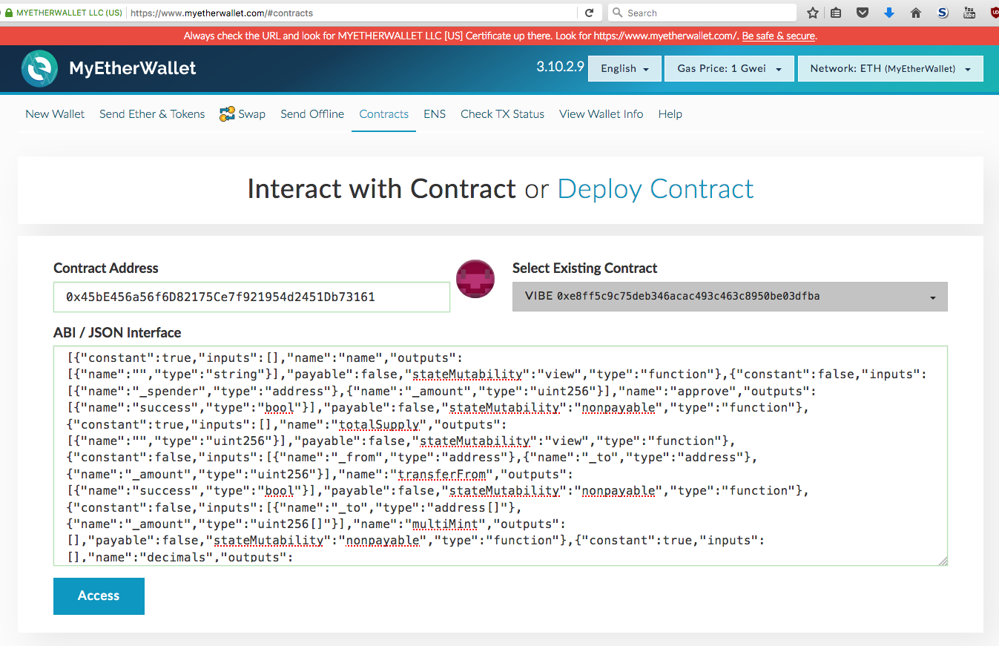</kbd>

Click on the **Access** button to view the list of functions you can read or write to:

<kbd>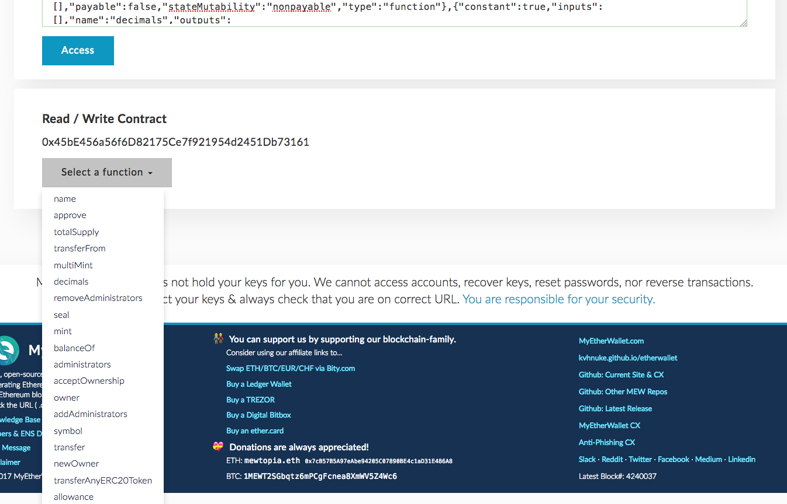</kbd>

 

## Transaction Cost

The cost of executing the `mint(...)` function to mint GBC tokens for a single address is about 68,000 units of `gas`. When
executing the `mint(...)` function, supply a bit more `gas` than the required number. 80,000 units is sufficient.

Each unit of `gas` is priced at the `gasPrice`. The transaction will cost `gas x gasPrice`.

In MyEtherWallet, the `gasPrice` is adjusted from the drop down on the top right of the web page where you can drag the slider to
alter the `gasPrice` used:

<kbd>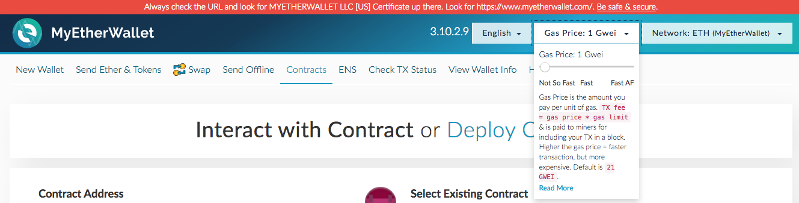</kbd>

The lower the specified `gasPrice`, the longer the transaction will take to get mined. Following is the current transaction cost:

* Low `gasPrice` 1 Gwei (1,000,000,000 wei) - actual transaction cost will be around 0.000080000 ETH (~ USD 0.03)
* Medium `gasPrice` 4 Gwei (4,000,000,000 wei) - actual transaction cost will be around 0.000320000 ETH (~ USD 0.12)
* High `gasPrice` 20 Gwei (20,000,000,000 wei) - actual transaction cost will be around 0.001600000 ETH (~ USD 0.60)

You can find an Ethereum unit conversion tool at [https://etherconverter.online/](https://etherconverter.online/).

 

 

Enjoy. (c) BokkyPooBah / Bok Consulting Pty Ltd for Gaze 2017. The MIT Licence.